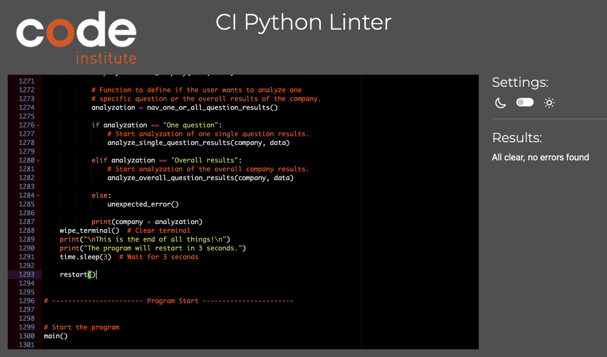

# EVP Survey

## Introduction

Code Institute - Portfolio Project 3 - Python Command-Line Application

[The deployed application can be found here](https://ci-pp3-survey-dennis-schenkel-25f95a95d1e3.herokuapp.com/)

This application is giving small companies a tool to do surveys among their employees to get valid information about what makes the company a special employer and what is the EVP (Employer Value Proposition). Therefore, users can do the survey and answer 8 questions that later can be used in an analyzation of the overall company results.
Users with an account are able to access the analyzation of the survey company results.

## Table of Contents

* [Introduction](#introduction)

* [User Experience](#user-experience-ux)
  * [User Stories](#user-stories)

* [Design](#design)
  * [Color Scheme](#color-scheme)
  * [Flowchart](#flowchart)

* [Features](#features)
  * [Technical Features](#technical-features)
  * [Accessibility](#accessibility)

* [Technologies Used](#technologies-used)
  * [Languages Used](#languages-used)
  * [Frameworks, Libraries Used](#frameworks--libraries-used)
  + [Programs Used](#programs-used)

* [Deployment](#deployment)
  * [Heroku deployment](#heroku-deployment)
  * [Excel file structure](#excel-file-structure)
  * [Questions used](#questions-used)

* [Testing](#testing)
  * [Validator Testing](#validator-testing)
  * [Manual Testing](#manual-testing)
  * [Known And Unfixed Bugs](#known--unfixed-bugs)
  * [Learnings](#learnings)
  * [Possible Improvements](#possible-improvements)

* [Credits](#credits)
  * [Acknowledgments](#acknowledgments)

## User Experience

This application is giving small companies a tool to do surveys among their employees to get valid information about what makes the company a special employer. Therefore, users can do the survey and answer 8 questions that later can be used in an analyzation of the overall company results.
Users with an account are able to access the analyzation of the survey company results.

### User Stories

**Employees doing the survey**

`
As an employee, I would like to select the company that I work for, so that I can do the survey.
`

`
As an employer. I want to be able to add another company to the list of companies, so I can do the survey for a company not already listed.`
`

**Employer analyzing survey results**

`
As a manager, I want to be able to log into a secured area, so that I get access to the survey results.
`

`
As a manager, I want be able to select a source of data, so that I am able to use my own excel file as data source.
`

`
As a manager, I would like to select the company that I work for, to work with only the relevant data.
`

`
As a manager, I would like to select the results of a specific question, to get only the results of this question.
`

`
As a manager, I would like to select an overview of the overall results of the company survey, to get all relevant information on one scree.
`

**All users**

`
As a user, I would like to be able to exit the application at any stage, so I am not trapped in a lengthy process that I can not stop.
`

## Design

### Color Scheme

This application uses only a few colors for highlighting important information and user options.

**Blue**

- Page headlines - All page headlines are in blue color.
- Highlighting important information - Important information like results are in blue color.

**Green**

- Highlighting navigation options - Options that can be selected by the user are in green color.
- Highlight successful login - when logged in, a screen with green text is shown to confirm login.

**Red**

- Highlighting important critical information - Critical information like invalid login attempt are in red color.
- Invalid input message - Information about invalid input is stated in red color.
- Highlighting of exit options - Exit options are in red color.

### Flowchart

The option to exit the program is indicated in the flowchart with "(Exit Opt.)" in every step, it is available.

## Features

- Terminal is cleared with every screen to keep a good overview and good user experience.
- The surveys can be conducted by anyone.
- Everyone doing a survey can add a new company, as long as it is not in the database.
- Results for companies can only be seen when logged in.
- Validation for every input.

### Technical Features

**User Login**

- User login: Users can log in by using a valid username and password.

- User data: The gspread file imported contains a sheet with information of multiple users, including username and password.

- 3 Invalid login attempts: When a user unsuccessfully tries to log in for three times, the program is ending and a message displayed that the account is blocked for 5 minutes. (This is not really happening due to avoiding misunderstanding when testing the app. This feature could easily be added by posting a time stamp in the user's gspread sheet and with every login attempt test if a time stamp of no longer then 5 minutes ago is associated with the user.)

**Data Source Selection**

- When selecting to analyze survey results, the user can choose between two different data sources to get data from. Google Spreadsheet as cloud service or a local Excel file. (The local Excel file must be located within the application folder. In the current state only the owner of the repository can add different files. In a later version a upload feature could be added.)

**Data Export**

- When a survey has been conducted, the results are exported to a gspread sheet and extended with the current date.

### Accessibility

- Since the application is solely console based, accessibility can not really be influenced by the creator. Still, it is important to make the console content as readable as possible by using colors and clear structures. In this application, I tried to make the content as understandable and readable as possible.

## Technologies Used

### Languages Used

- Python

### Modules & libraries used

**Google-Auth**
- Google-Auth helps with the authentication to use the Google API.

**gspread**
- gspread is needed for accessing and updating data in a Google spread sheet.

**xlrd**
- xlrd is a library that helps with reading data from Excel files (.xls).

**Panda**
- Panda helps with importing and analyzing data.

**openpyxl**
- openpyxl is a library that helps with reading data from Excel files (.xlsx/.xlsm).

**colorama**
- colorama helps with coloring the text and its background.

**Misc.**
- pyArrow - for panda integration
- os - for terminal wipe
- sys - Import sys for restart of app
- subprocess - Import subprocess for restart of app
- time - Import time for sleep feature
- datetime - Import to get date

### Programs Used

During the development of this application, the following programs have been used.

- VS Code
- Lucid
- Heroku
- Git
- GitHub
- Excel
- Google Spreadsheet
- CI Python Linter

## Deployment

### Heroku Deployment

**Step 0: Create requirements.txt**
- Create the requirements.txt
- Make sure it contains all needed moduls and libraries.

**Step 1: Use account**
- Create a Heroku account
- Log into the Heroku account

**Step 2: Create new app**
- On the dashboard click "New" in the upper right corner.
- Select "Create new app"
- Select a name for the application - the name should only contain lowercase letters, numbers, and dashes.
- Choose a region. (Europe as we are in Europe)

**Step 3: Define deployment methode**
- Select GitHub as deployment methode
- Connect GitHub account to Heroku
- Select account and search for repository
- Connect to found repository

**Step 4: Settings**
- Switch to the settings page (Menu in the top)
- Click on "Reveal Config Vars"
- Add one with the key "CREDS" and as value the content of the file creds.json from IDE.
- Add one with the key "PORT" and value of "8000"
- In the next section click on "Add buildpack"
- If not already selected, add Python.
- Add nodejs next.

**Step 5: Deploy application**
- Switch to the deploy page (Menu in the top)
- Look under manual deployment
- Select a branch to deploy (Main in my case)
- Click "Deploy Branche"

**Step 6: Use app**
- Heroku will then set up the virtual invirement with all modules and libraries needed. (This can take some time)
- When Heroku is done with the deployment, click "View" and start the
- Use app

### Excel file structure

The structure of the Excel file has to be as follow:

- Only one sheet
- Name of file and sheet does not matter
- Questions and kind of field input in first row
    -   Date, Name, Company Name, Questions
- Answers in following rows
- Question answeres between 0 and 10

[Gspread file can be found here](https://docs.google.com/spreadsheets/d/16vTHxofSbLFpQXTzHNgIS84chSTrg7NF4gkwami_Di0/edit?usp=sharing)

### Questions used

The following questions have been used in the survey:

- How motivated are you to come to work every day?
- How much do you feel valued and recognized for your work?
- How would you rate the opportunities for professional development and career opportunities in the company?
- Do you feel you are treated fairly and equally?
- How would you rate the company's salary and benefits?
- How transparent are decision-making processes in the company?
- How would you rate the leadership skills in the company?
- How well are new employees integrated into the company?

## Testing
### Validator Testing

The code validation with the Code Institute Python Linter shows no errors

### Manual Testing

| **Test** | **Description** | **Expected Outcome** | **Result** |
| --- | --- | --- | --- |
| **Welcome Screen** |  |  |  |
| --- | --- | --- | --- |
| Select "Do the survey" | Enter "1" and pressing enter | App accepting input and loading list of companies from gspread | Pass |
| Select "Login and analyze survey results" | Enter "2" and pressing enter | Accepting input, showing loading screen and login screen | Pass |
| Enter not shown option (int) | Enter an integer that is not shown and pressing enter | Show error message for wrong input and reload screen | Pass |
| Enter not shown option (str) | Enter a string that is not shown and pressing enter | Show error message for wrong input and reload screen | Pass |
| Enter not shown option (empty space) | Not enter anything and pressing enter | Show error message for wrong input and reload screen | Pass |
| --- | --- | --- | --- |
| **Conducting Survey** |  |  |  |
| --- | --- | --- | --- |
| **Select Company** |  |  |  |
| Select a shown company | Enter an int shown and press enter | Show screen to confirm selection and loading screen for input of first name | Pass |
| Select "Create new compyne" | Enter "NEW" and press enter | Show screen to enter new company name or exit the app | Pass |
| Enter "NEW" in not only upper cases | Enter "NEW" in various writings | Show screen to enter new company name or exit the app | Pass |
| Exit application | Enter "0" and press enter | Show confirmation screen that app is restarting in 2 seconds an then restarts | Pass |
| Enter not shown option (int) | Enter an integer that is not shown and pressing enter | Show error message for wrong input and reload screen | Pass |
| Enter not shown option (str) | Enter a string that is not shown and pressing enter | Show error message for wrong input and reload screen | Pass |
| Enter not shown option (empty space) | Not enter anything and pressing enter | Show error message for wrong input and reload screen | Pass |
| **Create New Company** |  |  |  |
| Enter new company name | Enter a new company name and press enter | Show screen to confirm entered new company name | Pass |
| Exit application | Enter "EXIT" and press enter | Show confirmation screen that app is restarting in 2 seconds an then restarts | Pass |
| Enter "EXIT" in not only upper cases | Enter "EXIT" in various writings | Show confirmation screen that app is restarting in 2 seconds an then restarts | Pass |
| Confirm new company name | Confirm new company name by pressing 1 and enter | Show next screen for entering the users first name | Pass |
| Decline new company name | Decline new company name by pressing 2 and enter | Reload screen to enter new comoany name | Pass |
| Enter existing company name | An existing company name is entered and confirmed | Show error message and exit hint and reload screen to enter new company name | Pass |
| **Enter Users First Name** |  |  |  |
| Enter name | Enter name with first letter uppercase and not more then 20 letters | Load first survey question with correct name in header | Pass |
| Enter wrong name (int) | Enter name with an integer in it | Show error screen with name conventions and reload after 5 seconds | Pass |
| Enter name with first letter not uppercase  | Enter name where the first letter or is not uppercase | Show error screen with name conventions and reload after 5 seconds | Pass |
| Enter name with wrong letter sizes  | Enter name where the first letter or is not uppercase and/or others are uppercase | Show error screen with name conventions and reload after 5 seconds | Pass |
| Enter name with empty space  | Enter name with an empty space in it | Show error screen with name conventions and reload after 5 seconds | Pass |
| Enter name with empty space  | Enter name with an empty space in it | Show error screen with name conventions and reload after 5 seconds | Pass |
| Enter name with with 20+ letters  | Enter name with to many letters (20+) | Show error screen with name conventions and reload after 5 seconds | Pass |
| **Answer Survey Questions** |  |  |  |
| Enter value between 0 and 10 | Enter a value that is between 0 and 10 and press enter | Load next question/screen | Pass |
| Enter value grater then 10 | Enter a value that is greater then 10 | Show error message for wrong input and reload screen | Pass |
| Enter incorrect | Enter a value that is no int from 0 to 10 (str, spaced, symbols) | Show error message for wrong input and reload screen | Pass |
| Exit application | Enter "EXIT" and press enter | Show confirmation screen that app is restarting in 2 seconds an then restarts | Pass |
| Enter "EXIT" in not only upper cases | Enter "EXIT" in various writings | Show confirmation screen that app is restarting in 2 seconds an then restarts | Pass |
| Complete survey | Answer all questions with valide input | Load thany you screen with user name and company, then load reload screen and restart app | Pass |
| Complete survey data upload | Answer all questions with valide input | Data is uploaded as a new row to gspread with current date | Pass |

| **Test** | **Description** | **Expected Outcome** | **Result** |
| --- | --- | --- | --- |
| **Analyzing Results** |  |  |  |
| --- | --- | --- | --- |
| **User Login** |  |  |  |
| Enter correct username | Enter "Test" as username and press enter | Display input for password | Pass |
| Enter correct password | Enter "Test" as password and press enter | Show screen with login confirmation, followed by data source selection | Pass |
| Enter incorrect login credentials | Enter ether wrong username or password or both | Display error message and increase failed attempts counter | Pass |
| 3 fails login attemts | Use incorrect login credentials for 3 times | Increase failed attempts counter and restart app after third failed attempt | Pass |
| **Select Data Source** |  |  |  |
| Select "Import Excel file to analyze" | Enter "1" and press enter | Show screen with input of Excel file name | Pass |
| Correct Excel file name | Enter a correct Excel file name and press enter | Show screen for selection of company | Pass |
| Wrong Excel file name | Enter a wrong Excel file name and press enter | Show error screen with option to try again or not | Pass |
| Try again entering Excel file name | Enter "1" and press enter | Show screen with input of Excel file name | Pass |
| Exit application | Enter "0" and press enter | Show confirmation screen that app is restarting in 2 seconds an then restarts | Pass |
| Select "Use Google sheet to analyze" | Enter "2" and press enter | Show screen for selection of company | Pass |
| Enter not shown option (int) | Enter an integer that is not shown and pressing enter | Show error message for wrong input and reload screen | Pass |
| Enter not shown option (str) | Enter a string that is not shown and pressing enter | Show error message for wrong input and reload screen | Pass |
| Enter not shown option (empty space) | Not enter anything and pressing enter | Show error message for wrong input and reload screen | Pass |
| Exit application | Enter "0" and press enter | Show confirmation screen that app is restarting in 2 seconds an then restarts | Pass |
| **Select Company** |  |  |  |
| Select a shown company | Enter an int shown and press enter | Show screen to confirm selection and loading screen for selecting type of analyzation | Pass |
| Enter not shown option (int) | Enter an integer that is not shown and pressing enter | Show error message for wrong input and reload screen | Pass |
| Enter not shown option (str) | Enter a string that is not shown and pressing enter | Show error message for wrong input and reload screen | Pass |
| Enter not shown option (empty space) | Not enter anything and pressing enter | Show error message for wrong input and reload screen | Pass |
| Exit application | Enter "0" and press enter | Show confirmation screen that app is restarting in 2 seconds an then restarts | Pass |
| **Select Results Type** |  |  |  |
| Select "Analyze one single survey question" | Enter "1" and press enter | Show screen with individual question to select | Pass |
| Select "Analyze overall survey results" | Enter "2" and press enter | Show screen with the overall survey results for company | Pass |
| Exit application | Enter "0" and press enter | Show confirmation screen that app is restarting in 2 seconds an then restarts | Pass |
| Enter not shown option (int) | Enter an integer that is not shown and pressing enter | Show error message for wrong input and reload screen | Pass |
| Enter not shown option (str) | Enter a string that is not shown and pressing enter | Show error message for wrong input and reload screen | Pass |
| Enter not shown option (empty space) | Not enter anything and pressing enter | Show error message for wrong input and reload screen | Pass |
| **Analyze One Servey Question Step 1** |  |  |  |
| Select a shown question (int between 1 and 8) | Enter one shown int and press enter | Show screen to confirm selected question and load screen with question results | Pass |
| Exit application | Enter "0" and press enter | Show confirmation screen that app is restarting in 2 seconds an then restarts | Pass |
| Enter not shown option (int) | Enter an integer that is not shown and pressing enter | Show error message for wrong input and reload screen | Pass |
| Enter not shown option (str) | Enter a string that is not shown and pressing enter | Show error message for wrong input and reload screen | Pass |
| Enter not shown option (empty space) | Not enter anything and pressing enter | Show error message for wrong input and reload screen | Pass |
| **Analyze One Servey Question Step 2** |  |  |  |
| Continue after result | Enter any key and press enter | Show screen with the next options | Pass |
| Select "Analyze another question" | Enter "1" and pressing enter | Show screen with individual question to select | Pass |
| Select "Analyze a different company" | Enter "2" and press enter | Show screen with all availabe companies to select | Pass |
| Exit application | Enter "0" and press enter | Show confirmation screen that app is restarting in 2 seconds an then restarts | Pass |
| Enter not shown option (int) | Enter an integer that is not shown and pressing enter | Show error message for wrong input and reload screen | Pass |
| Enter not shown option (str) | Enter a string that is not shown and pressing enter | Show error message for wrong input and reload screen | Pass |
| Enter not shown option (empty space) | Not enter anything and pressing enter | Show error message for wrong input and reload screen | Pass |
| **Analyze Overall Results** |  |  |  |
| Select "Analyze a different company" | Enter "1" and press enter | Show screen with all availabe companies to select | Pass |
| Exit application | Enter "0" and press enter | Show confirmation screen that app is restarting in 2 seconds an then restarts | Pass |
| Enter not shown option (int) | Enter an integer that is not shown and pressing enter | Show error message for wrong input and reload screen | Pass |
| Enter not shown option (str) | Enter a string that is not shown and pressing enter | Show error message for wrong input and reload screen | Pass |
| Enter not shown option (empty space) | Not enter anything and pressing enter | Show error message for wrong input and reload screen | Pass |

### Known And Unfixed Bugs

- When the list of available companies in gspread gets to long, the clear terminal function doesn't work as intended. The function only deletes the part visible in the console. The part above the visible part, that is only visible when scrolled upwards, won't be deleted correctly and stays in the console for the time the app runs.

### Learnings

### Possible Improvements

- Deactivating user account for five minutes after three failed login attempts.
- User can upload own Excel file with survey results to analyze.
- Uploaded Excel file will be checked for correct structure and data validity.
- Improving the visual design with some ASCII art and other ways for better structuring.
- More sophisticated analyzing algorithm.

## Credits
### Acknowledgments

## Acknowledgement

Although I not copied entire code, I'd like to acknoledge the following resources as inspiration

- Restart() - using subprocess and sys
    - Great information about how to use subprocesses and sys instead ob os if to find here: https://www.dataquest.io/blog/python-subprocess/ 

- wipe_terminal() - using os 
    - A lengthy discussion on the various methodes of clearing the termal is to find here: https://stackoverflow.com/questions/2084508/clear-the-terminal-in-python

